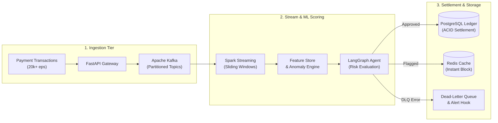
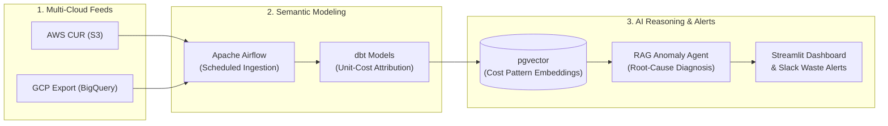

  <h1>Muhammad Yekini</h1>

  

  

    
    
    
    
  

---

## Executive Overview
- **Track Record:** 5+ years designing and operating mission-critical financial data pipelines across fintech and digital banking (**WAYA Bank**, **Earnipay**, **Mobi Automation**, **Bincom Dev Center**).
- **Core Focus:** Distributed real-time stream processing (**Kafka**, **Spark Streaming**), resilient analytics engineering (**dbt**, **Airflow**), and autonomous AI agent systems (**LangGraph**, **pgvector**, **RAG**).
- **FinOps & Cloud Economics:** Cloud cost governance, unit economics modeling, and automated reconciliation architectures.
- **Ecosystem:** Founder of **[STACC](https://getstacc.org)** (Data & Tech Community) and creator of **[LOBB](https://lobb.ng)** (Tennis Court & Club Booking Platform).

---

## Production Impact & Experience

| Environment | Scope & High-Impact Engineering Metrics | Core Stack |
| :--- | :--- | :--- |
| **Fintech & Banking** WAYA Bank • Earnipay | • **High-Volume Settlement:** Engineered event-driven ledger pipelines processing **$50M+ in cumulative transactions** with zero ledger drift. • **Sub-Second SLA:** Built real-time stream ingestion monitoring achieving **<500ms p99 latency** and automated dead-letter-queue (DLQ) reconciliation. • **High Availability:** Maintained **99.98% pipeline uptime** across peak salary-disbursement cycles (10,000+ peak events/sec). | `Kafka` `Spark` `PostgreSQL` `Airflow` |
| **FinOps & Cloud Strategy** Advisory / Systems | • **Cost Reduction:** Implemented automated resource tagging & right-sizing telemetry, cutting **28% in annualized cloud compute waste** across AWS & GCP. • **Unit-Cost Attribution:** Mapped infrastructure expenditure down to per-user transaction unit economics via dbt semantic data marts. | `AWS Cost Explorer` `BigQuery` `dbt` `Python` |

---

## System Architecture & Technologies

| Layer | Technologies |
| :--- | :--- |
| **Streaming & Ingestion** |     |
| **AI, Agents & Vector Search** |     |
| **Storage & Caching** |    |
| **Cloud & Infrastructure** |     |

---

## Featured Systems

| Project | Focus Architecture | Target Stack | Status |
| :--- | :--- | :--- | :--- |
| **FinTrust** | Event-Driven Fraud Detection & Settlement Engine | `Kafka` `Spark` `FastAPI` `LangChain` | `Active Build` |
| **CloudMargin** | Autonomous Cloud Unit-Cost & FinOps Intelligence | `dbt` `Airflow` `pgvector` `Streamlit` | `System Spec` |
| **BankPulse** | Real-Time Core Banking Product Metrics | `dbt Core` `FastAPI` `LLM Agents` | `Design RFC` |
| **LOBB** | Real-Time Tennis Court & Club Booking Platform | [lobb.ng](https://lobb.ng) | `Production` |

<b>System Blueprint: FinTrust (Event-Driven Fraud Detection & Settlement)</b>

 

<b>System Blueprint: CloudMargin (Autonomous FinOps Intelligence Engine)</b>

 

---

## Writing & Architecture Notes

Engineering deep dives on streaming architecture, agentic workflows, and cloud economics:

<!-- BLOG-POST-LIST:START -->
- [Best websites to learn code 2021](https://muhammadyk.medium.com/best-websites-to-learn-code-2021-5c8a53a9dec1?source=rss-8607d1202f88------2)
<!-- BLOG-POST-LIST:END -->

Read more on **[Medium (@muhammadyk)](https://muhammadyk.medium.com/)**.

---

## Activity

  
  

---

  
<b>Open for:</b> Real-Time Data Pipeline Architecture • FinOps Cloud Audits • Senior Engineering Inquiries

  Direct contact: <a href="mailto:myekini1@gmail.com">myekini1@gmail.com</a>

